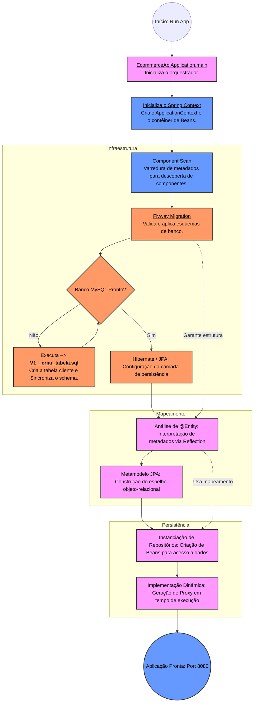

# Arquitetura e Fluxo de Inicialização

Este documento apresenta a análise técnica da arquitetura de inicialização da API, detalhando o comportamento interno do *framework* Spring Boot durante seu processo de *bootstrapping*. O objetivo é documentar a transição da aplicação entre seu estado estático — código-fonte compilado — e seu estado operacional, gerenciado dinamicamente em tempo de execução.

## O Núcleo: `SpringApplication.run` e a Gestão de Ciclo de Vida

A invocação da classe `EcommerceApiApplication` através do método `SpringApplication.run` constitui o ponto de entrada da aplicação. Este comando não é meramente um iniciador de processo, mas um orquestrador que delega a gestão da aplicação ao contêiner Spring.

### Fundamentos da Orquestração
1.  **Instanciação do Contêiner (*ApplicationContext*)**: O Spring gera um repositório centralizado de objetos vivos, denominado *ApplicationContext*. Este contêiner é único por aplicação e atua como a infraestrutura que mantém o estado e a configuração dos componentes.
2.  **Inversão de Controle (IoC)**: Através da IoC, o *framework* assume a responsabilidade pela criação e configuração de todos os objetos gerenciados (denominados *Beans*). Esta abordagem elimina a necessidade de instanciação manual via operador `new`, delegando ao *framework* o encadeamento de dependências e a integridade do sistema.
3.  **Encapsulamento de Componentes**: Cada classe identificada como um componente (ex: Repositórios, Serviços) torna-se um *Bean*. Um *Bean* é, essencialmente, a instância gerenciada de uma classe que o Spring "adota", supervisionando todo o seu ciclo de existência — desde a sua inicialização até a sua destruição final.

---

## Fluxo de Inicialização (*Bootstrap*)

O diagrama a seguir sintetiza a sequência lógica de inicialização, evidenciando as camadas de configuração que garantem que o sistema esteja íntegro antes de expor seus *endpoints*.

---

## Detalhamento das Etapas Técnicas

* **Inicialização do Contexto (*ApplicationContext*):** Criação do contêiner central. Este ambiente não apenas armazena os *Beans*, mas provê a infraestrutura necessária para que esses componentes interajam sem que o desenvolvedor gerencie suas dependências manualmente.
* **Varredura de Componentes (*Component Scan*):** O *framework* executa uma varredura recursiva para identificar etiquetas (anotações). Estas anotações sinalizam ao Spring que a classe deve ser instanciada como um *Bean* e ter seu ciclo de vida monitorado pelo contêiner.
* **Infraestrutura (Flyway):** Camada de conformidade que assegura a integridade estrutural do banco de dados relacional antes da ativação da lógica de negócio.
* **Mapeamento (Hibernate/JPA):** Processamento das classes `@Entity`. Através da API de *Reflection*, o sistema mapeia a estrutura de classes para tabelas de banco, consolidando o metamodelo que permite a persistência abstrata.
* **Persistência e Proxy:** A identificação de interfaces como `JpaRepository` ativa a injeção de uma implementação dinâmica. O Spring utiliza o padrão *Proxy* para fornecer, em tempo de execução, a lógica de persistência (CRUD), abstraindo a complexidade das consultas SQL e garantindo uma camada de acesso a dados robusta.

