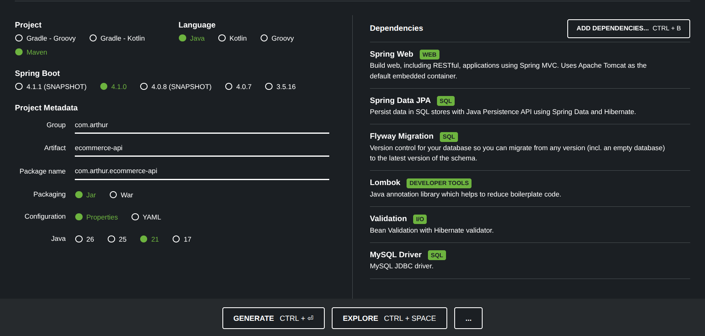

# Projeto: E-commerce API (Spring Boot + MySQL)

> Roteiro de execução em formato de log técnico, construído dia a dia, para servir tanto de **guia reprodutível** quanto de **peça de portfólio** (estilo entrega de job freelancer no Workana).

## Objetivo

Desenvolver uma API REST robusta para gestão de clientes, produtos e pedidos, priorizando boas práticas de engenharia: arquitetura em camadas, versionamento de banco, validação de dados, segurança com JWT, testes automatizados e documentação via Swagger.

## Stack Tecnológica

| Categoria | Tecnologia |
|---|---|
| Linguagem | Java 21 |
| Framework | Spring Boot 4.1.x |
| Persistência | Spring Data JPA + Hibernate |
| Banco de Dados | MySQL 8.0 (via Docker) |
| Migrations | Flyway |
| Boilerplate | Lombok |
| Validação | Jakarta Bean Validation |
| Build | Maven |
| Infra local | Docker / Docker Compose |
| IDE | IntelliJ IDEA |
| SO do autor | Kubuntu (Linux) |

## Metadados do projeto (Spring Initializr)

- **Project:** Maven
- **Language:** Java
- **Spring Boot:** versão estável mais recente (sem SNAPSHOT)
- **Group:** `com.arthur`
- **Artifact:** `ecommerce-api`
- **Packaging:** Jar
- **Java:** 21
- **Dependencies selecionadas:** Spring Web, Spring Data JPA, Flyway Migration, Lombok, Validation
  - *Obs:* o driver de banco foi trocado depois — ver ajuste no DIA 01.

## Estrutura de pastas (estado atual)

```
ecommerce-api/
├── docker-compose.yml
├── pom.xml
├── src/
│   └── main/
│       ├── java/com/arthur/ecommerce_api/
│       │   ├── EcommerceApiApplication.java
│       │   ├── model/
│       │   │   └── Cliente.java
│       │   └── repository/
│       │       └── ClienteRepository.java
│       └── resources/
│           ├── application.properties
│           └── db/migration/
│               └── V1__criar_tabela_cliente.sql
├── docs/           # Documentação técnica e logs
│   └── project_log.md
```

---

## DIA 01 — Infraestrutura e Base (log reproduzível)

**Status ao final do dia:** projeto compilando, container MySQL rodando via Docker, Flyway aplicando migrações com sucesso, entidade `Cliente` mapeada e `ClienteRepository` funcional.

### 1. Bootstrap do projeto (Spring Initializr)

1. Acesse [start.spring.io](https://start.spring.io/).
2. Configure exatamente:
   - Project: **Maven**
   - Language: **Java**
   - Spring Boot: versão estável mais recente
   - Group: `com.arthur`
   - Artifact: `ecommerce-api`
   - Packaging: **Jar**
   - Java: **21**
3. Em "Add Dependencies", adicione:
   - Spring Web
   - Spring Data JPA
   - Flyway Migration
   - Lombok
   - Validation
   - *(PostgreSQL Driver foi adicionado inicialmente, mas substituído pelo MySQL — ver passo 5)*
4. Clique em **Generate**, baixe o `.zip`, descompacte e abra a pasta no IntelliJ.

<p align="center">
  
</p>

### 2. Instalação do Docker

Caso o Docker/Docker Compose ainda não estejam instalados:

```bash
# 1. Atualizar índice de pacotes
sudo apt update

# 2. Instalar dependências
sudo apt install apt-transport-https ca-certificates curl gnupg lsb-release

# 3. Adicionar chave GPG oficial do Docker
curl -fsSL https://download.docker.com/linux/ubuntu/gpg | sudo gpg --dearmor -o /usr/share/keyrings/docker-archive-keyring.gpg

# 4. Adicionar repositório do Docker
echo "deb [arch=$(dpkg --print-architecture) signed-by=/usr/share/keyrings/docker-archive-keyring.gpg] https://download.docker.com/linux/ubuntu $(lsb_release -cs) stable" | sudo tee /etc/apt/sources.list.d/docker.list > /dev/null

# 5. Instalar Docker
sudo apt update
sudo apt install docker-ce docker-ce-cli containerd.io docker-compose-plugin

# 6. Permitir uso sem sudo (requer logout/login depois)
sudo usermod -aG docker $USER
```

> ⚠️ Após o `usermod`, é obrigatório **fazer logout/login** (ou reiniciar) para a permissão de grupo `docker` ter efeito. Sem isso, ocorre o erro `permission denied while trying to connect to the docker API`.

Verificação:
```bash
docker --version
docker compose version
```

### 3. Infraestrutura com Docker Compose (MySQL)

Na raiz do projeto (mesmo nível do `pom.xml`), criar `docker-compose.yml`:

```yaml
services:
  mysql:
    image: mysql:8.0
    container_name: ecommerce-db
    environment:
      MYSQL_ROOT_PASSWORD: password
      MYSQL_DATABASE: ecommerce
      MYSQL_USER: admin
      MYSQL_PASSWORD: password
    ports:
      - "3306:3306"
```

Subir o container (terminal do IntelliJ, na raiz do projeto):

```bash
docker compose up -d
```
*(no Docker moderno o comando é `docker compose`, sem hífen — `docker-compose` é o binário legado, que pode não estar instalado)*

Confirmar sucesso: saída deve mostrar `Container ecommerce-db Started`.

### 4. Ajuste do `pom.xml` — driver MySQL

Trocar a dependência do PostgreSQL pela do MySQL:

```xml
<dependency>
    <groupId>com.mysql</groupId>
    <artifactId>mysql-connector-j</artifactId>
    <scope>runtime</scope>
</dependency>
```

### 5. Configuração de conexão — `application.properties`

Arquivo: `src/main/resources/application.properties`

```properties
# Conexão com o MySQL
spring.datasource.url=jdbc:mysql://localhost:3306/ecommerce?useSSL=false&serverTimezone=UTC
spring.datasource.username=admin
spring.datasource.password=password

# Configurações do Hibernate/JPA
spring.jpa.hibernate.ddl-auto=validate
spring.jpa.show-sql=true
spring.jpa.properties.hibernate.dialect=org.hibernate.dialect.MySQLDialect

# Flyway (Gestão de migrações)
spring.flyway.enabled=true
```

> **`ddl-auto=validate`** é proposital: o Hibernate fica proibido de criar/alterar tabelas sozinho. Toda evolução do schema passa pelo Flyway — prática de mercado.

#### 5.1 Troubleshooting: `Public Key Retrieval is not allowed`

Ao rodar a aplicação pela primeira vez, ocorreu o erro:

```
Caused by: com.mysql.cj.exceptions.UnableToConnectException: Public Key Retrieval is not allowed
```

**Causa:** o MySQL 8+ usa por padrão o método de autenticação `caching_sha2_password`, que exige troca de chave pública durante o handshake; o driver JDBC bloqueia isso por padrão por segurança.

**Correção:** adicionar `allowPublicKeyRetrieval=true` na URL de conexão. Como esse parâmetro precisa vir *depois* do `serverTimezone`, a linha final ficou:

```properties
spring.datasource.url=jdbc:mysql://localhost:3306/ecommerce?useSSL=false&serverTimezone=UTC&allowPublicKeyRetrieval=true
```

> Isso é seguro em ambiente local/Docker; em produção, o ideal é usar TLS (`useSSL=true`) em vez de liberar a recuperação de chave pública.

### 6. Primeira execução ("batismo")

No IntelliJ, clique em **Run ▶** na classe `EcommerceApiApplication` (ou no botão *Play* ao lado do `main`):

```java
package com.arthur.ecommerce_api;

import org.springframework.boot.SpringApplication;
import org.springframework.boot.autoconfigure.SpringBootApplication;

@SpringBootApplication
public class EcommerceApiApplication {

	public static void main(String[] args) {
		SpringApplication.run(EcommerceApiApplication.class, args);
	}

}
```

Log de sucesso esperado termina com:
```
Started EcommerceApiApplication in X.XXX seconds
```

#### Log da primeira execução (detalhado):

```log
  .   ____          _            __ _ _
 /\\ / ___'_ __ _ _(_)_ __  __ _ \ \ \ \
( ( )\___ | '_ | '_| | '_ \/ _` | \ \ \ \
 \\/  ___)| |_)| | | | | || (_| |  ) ) ) )
  '  |____| .__|_| |_|_| |_\__, | / / / /
 =========|_|==============|___/=/_/_/_/

 :: Spring Boot ::                (v4.1.0)

2026-07-02T08:41:37.742-03:00  INFO 28353 --- [           main] c.a.e.EcommerceApiApplication            : Starting EcommerceApiApplication using Java 21.0.11 with PID 28353 (/home/arthur/Downloads/10-Projetos/ecommerce-api/target/classes started by arthur in /home/arthur/Downloads/10-Projetos/ecommerce-api)
2026-07-02T08:41:37.744-03:00  INFO 28353 --- [           main] c.a.e.EcommerceApiApplication            : No active profile set, falling back to 1 default profile: "default"
2026-07-02T08:41:38.635-03:00  INFO 28353 --- [           main] o.s.boot.tomcat.TomcatWebServer          : Tomcat initialized with port 8080 (http)
2026-07-02T08:41:38.652-03:00  INFO 28353 --- [           main] o.apache.catalina.core.StandardService   : Starting service [Tomcat]
2026-07-02T08:41:38.652-03:00  INFO 28353 --- [           main] o.apache.catalina.core.StandardEngine    : Starting Servlet engine: [Apache Tomcat/11.0.22]
2026-07-02T08:41:38.697-03:00  INFO 28353 --- [           main] b.w.c.s.WebApplicationContextInitializer : Root WebApplicationContext: initialization completed in 907 ms
2026-07-02T08:41:39.054-03:00  INFO 28353 --- [           main] o.s.boot.tomcat.TomcatWebServer          : Tomcat started on port 8080 (http) with context path '/'
2026-07-02T08:41:39.059-03:00  INFO 28353 --- [           main] c.a.e.EcommerceApiApplication            : Started EcommerceApiApplication in 1.794 seconds (process running for 2.828)
```


### 7. Primeira migração Flyway — tabela `cliente`

1. Criar a pasta (se não existir): `src/main/resources/db/migration`.
2. Dentro dela, criar o arquivo `V1__criar_tabela_cliente.sql` (convenção Flyway: `V<versão>__descricao.sql`).

```sql
CREATE TABLE cliente (
                         id BIGINT NOT NULL AUTO_INCREMENT,
                         nome VARCHAR(100) NOT NULL,
                         email VARCHAR(100) NOT NULL UNIQUE,
                         cpf VARCHAR(14) NOT NULL UNIQUE,
                         data_criacao DATETIME DEFAULT CURRENT_TIMESTAMP,
                         PRIMARY KEY (id)
);
```

3. Rodar a aplicação novamente. O log deve mostrar:
```
Migrating schema `ecommerce` to version "1 - criar tabela cliente"
Successfully applied 1 migration to schema `ecommerce`, now at version v1
```

> ⚠️ Regra de ouro do Flyway: **nunca editar um arquivo `V` já commitado/aplicado**. Qualquer mudança futura de schema deve ser um novo arquivo, ex.: `V2__adicionar_coluna_telefone_em_cliente.sql`.

#### Detalhes do log de execução:

```log
  .   ____          _            __ _ _
 /\\ / ___'_ __ _ _(_)_ __  __ _ \ \ \ \
( ( )\___ | '_ | '_| | '_ \/ _` | \ \ \ \
 \\/  ___)| |_)| | | | | || (_| |  ) ) ) )
  '  |____| .__|_| |_|_| |_\__, | / / / /
 =========|_|==============|___/=/_/_/_/

 :: Spring Boot ::                (v4.1.0)

2026-07-02T09:00:13.346-03:00  INFO 32308 --- [           main] c.a.e.EcommerceApiApplication            : Starting EcommerceApiApplication using Java 21.0.11 with PID 32308 (/home/arthur/Downloads/10-Projetos/ecommerce-api/target/classes started by arthur in /home/arthur/Downloads/10-Projetos/ecommerce-api)
2026-07-02T09:00:13.348-03:00  INFO 32308 --- [           main] c.a.e.EcommerceApiApplication            : No active profile set, falling back to 1 default profile: "default"
2026-07-02T09:00:13.889-03:00  INFO 32308 --- [           main] .s.d.r.c.RepositoryConfigurationDelegate : Bootstrapping Spring Data JPA repositories in DEFAULT mode.
2026-07-02T09:00:13.932-03:00  INFO 32308 --- [           main] .s.d.r.c.RepositoryConfigurationDelegate : Finished Spring Data repository scanning in 34 ms. Found 1 JPA repository interface.
2026-07-02T09:00:14.303-03:00  INFO 32308 --- [           main] o.s.boot.tomcat.TomcatWebServer          : Tomcat initialized with port 8080 (http)
2026-07-02T09:00:14.314-03:00  INFO 32308 --- [           main] o.apache.catalina.core.StandardService   : Starting service [Tomcat]
2026-07-02T09:00:14.314-03:00  INFO 32308 --- [           main] o.apache.catalina.core.StandardEngine    : Starting Servlet engine: [Apache Tomcat/11.0.22]
2026-07-02T09:00:14.355-03:00  INFO 32308 --- [           main] b.w.c.s.WebApplicationContextInitializer : Root WebApplicationContext: initialization completed in 960 ms
2026-07-02T09:00:14.589-03:00  INFO 32308 --- [           main] com.zaxxer.hikari.HikariDataSource       : HikariPool-1 - Starting...
2026-07-02T09:00:14.775-03:00  INFO 32308 --- [           main] com.zaxxer.hikari.pool.HikariPool        : HikariPool-1 - Added connection com.mysql.cj.jdbc.ConnectionImpl@6842c101
2026-07-02T09:00:14.776-03:00  INFO 32308 --- [           main] com.zaxxer.hikari.HikariDataSource       : HikariPool-1 - Start completed.
2026-07-02T09:00:14.803-03:00  INFO 32308 --- [           main] org.flywaydb.core.FlywayExecutor         : Database: jdbc:mysql://localhost:3306/ecommerce?useSSL=false&serverTimezone=UTC&allowPublicKeyRetrieval=true (MySQL 8.0)
2026-07-02T09:00:14.946-03:00  INFO 32308 --- [           main] o.f.core.internal.command.DbValidate     : Successfully validated 1 migration (execution time 00:00.022s)
2026-07-02T09:00:14.957-03:00  INFO 32308 --- [           main] o.f.core.internal.command.DbMigrate      : Current version of schema `ecommerce`: 1
2026-07-02T09:00:14.962-03:00  INFO 32308 --- [           main] o.f.core.internal.command.DbMigrate      : Schema `ecommerce` is up to date. No migration necessary.
2026-07-02T09:00:15.067-03:00  INFO 32308 --- [           main] org.hibernate.orm.jpa                    : HHH008540: Processing PersistenceUnitInfo [name: default]
2026-07-02T09:00:15.146-03:00  INFO 32308 --- [           main] org.hibernate.orm.core                   : HHH000001: Hibernate ORM core version 7.4.1.Final
2026-07-02T09:00:15.555-03:00  INFO 32308 --- [           main] o.s.o.j.p.SpringPersistenceUnitInfo      : No LoadTimeWeaver setup: ignoring JPA class transformer
2026-07-02T09:00:15.616-03:00  WARN 32308 --- [           main] org.hibernate.orm.deprecation            : HHH90000025: MySQLDialect does not need to be specified explicitly using 'hibernate.dialect' (remove the property setting and it will be selected by default)
2026-07-02T09:00:15.625-03:00  INFO 32308 --- [           main] org.hibernate.orm.connections.pooling    : HHH10001005: Database info:
	Database JDBC URL [jdbc:mysql://localhost:3306/ecommerce?useSSL=false&serverTimezone=UTC&allowPublicKeyRetrieval=true]
	Database driver: MySQL Connector/J
	Database dialect: MySQLDialect
	Database version: 8.0.46
	Default catalog/schema: ecommerce/undefined
	Autocommit mode: undefined/unknown
	Isolation level: REPEATABLE_READ [default REPEATABLE_READ]
	JDBC fetch size: none
	Pool: DataSourceConnectionProvider
	Minimum pool size: undefined/unknown
	Maximum pool size: undefined/unknown
2026-07-02T09:00:16.380-03:00  INFO 32308 --- [           main] org.hibernate.orm.core                   : HHH000489: No JTA platform available (set 'hibernate.transaction.jta.platform' to enable JTA platform integration)
2026-07-02T09:00:16.410-03:00  INFO 32308 --- [           main] j.LocalContainerEntityManagerFactoryBean : Initialized JPA EntityManagerFactory for persistence unit 'default'
2026-07-02T09:00:16.452-03:00  WARN 32308 --- [           main] JpaBaseConfiguration$JpaWebConfiguration : spring.jpa.open-in-view is enabled by default. Therefore, database queries may be performed during view rendering. Explicitly configure spring.jpa.open-in-view to disable this warning
2026-07-02T09:00:16.753-03:00  INFO 32308 --- [           main] o.s.d.j.r.query.QueryEnhancerFactories   : Hibernate is in classpath; If applicable, HQL parser will be used.
2026-07-02T09:00:16.864-03:00  INFO 32308 --- [           main] o.s.boot.tomcat.TomcatWebServer          : Tomcat started on port 8080 (http) with context path '/'
2026-07-02T09:00:16.868-03:00  INFO 32308 --- [           main] c.a.e.EcommerceApiApplication            : Started EcommerceApiApplication in 3.91 seconds (process running for 4.734)
```

#### Detalhes da tabela `flyway_schema_history`:

```sql
mysql> describe flyway_schema_history;
+----------------+---------------+------+-----+-------------------+-------------------+
| Field          | Type          | Null | Key | Default           | Extra             |
+----------------+---------------+------+-----+-------------------+-------------------+
| installed_rank | int           | NO   | PRI | NULL              |                   |
| version        | varchar(50)   | YES  |     | NULL              |                   |
| description    | varchar(200)  | NO   |     | NULL              |                   |
| type           | varchar(20)   | NO   |     | NULL              |                   |
| script         | varchar(1000) | NO   |     | NULL              |                   |
| checksum       | int           | YES  |     | NULL              |                   |
| installed_by   | varchar(100)  | NO   |     | NULL              |                   |
| installed_on   | timestamp     | NO   |     | CURRENT_TIMESTAMP | DEFAULT_GENERATED |
| execution_time | int           | NO   |     | NULL              |                   |
| success        | tinyint(1)    | NO   | MUL | NULL              |                   |
+----------------+---------------+------+-----+-------------------+-------------------+
10 rows in set (0.01 sec)

mysql> SELECT * FROM flyway_schema_history;
+----------------+---------+----------------------+------+------------------------------+-------------+--------------+---------------------+----------------+---------+
| installed_rank | version | description          | type | script                       | checksum    | installed_by | installed_on        | execution_time | success |
+----------------+---------+----------------------+------+------------------------------+-------------+--------------+---------------------+----------------+---------+
|              1 | 1       | criar tabela cliente | SQL  | V1__criar_tabela_cliente.sql | -1655408015 | admin        | 2026-07-01 23:53:54 |            104 |       1 |
+----------------+---------+----------------------+------+------------------------------+-------------+--------------+---------------------+----------------+---------+
1 row in set (0.00 sec)
```

#### Detalhes da tabela `cliente`:

```sql
mysql> describw cliente;
ERROR 1064 (42000): You have an error in your SQL syntax; check the manual that corresponds to your MySQL server version for the right syntax to use near 'describw cliente' at line 1
mysql> describe cliente;
+--------------+--------------+------+-----+-------------------+-------------------+
| Field        | Type         | Null | Key | Default           | Extra             |
+--------------+--------------+------+-----+-------------------+-------------------+
| id           | bigint       | NO   | PRI | NULL              | auto_increment    |
| nome         | varchar(100) | NO   |     | NULL              |                   |
| email        | varchar(100) | NO   | UNI | NULL              |                   |
| cpf          | varchar(14)  | NO   | UNI | NULL              |                   |
| data_criacao | datetime     | YES  |     | CURRENT_TIMESTAMP | DEFAULT_GENERATED |
+--------------+--------------+------+-----+-------------------+-------------------+
5 rows in set (0.03 sec)

mysql> SELECT * FROM cliente;
Empty set (0.00 sec)
```


### 8. Entidade JPA `Cliente`

Criar o pacote `model` dentro de `com.arthur.ecommerce_api`, e a classe `Cliente`:

```java
package com.arthur.ecommerce_api.model;

import jakarta.persistence.*;
import lombok.*;

import java.time.LocalDateTime;

@Entity(name = "cliente")
@Table(name = "cliente")
@Getter
@Setter
@NoArgsConstructor
@AllArgsConstructor
@EqualsAndHashCode(of = "id")
public class Cliente {

    @Id
    @GeneratedValue(strategy = GenerationType.IDENTITY)
    private Long id;

    private String nome;

    @Column(unique = true)
    private String email;

    @Column(unique = true)
    private String cpf;

    @Column(name = "data_criacao")
    private LocalDateTime dataCriacao = LocalDateTime.now();
}
```

**Notas de mapeamento:**
- `@Entity` + `@Table`: vincula a classe à tabela `cliente`.
- `@Id` + `@GeneratedValue(strategy = GenerationType.IDENTITY)`: delega o auto-incremento ao MySQL (`AUTO_INCREMENT`).
- `@Column(unique = true)`: reforça no nível JPA as constraints `UNIQUE` já definidas no SQL.
- Anotações Lombok (`@Getter`, `@Setter`, `@NoArgsConstructor`, `@AllArgsConstructor`, `@EqualsAndHashCode`) eliminam boilerplate.

### 9. Repositório Spring Data JPA

Criar o pacote `repository` dentro de `com.arthur.ecommerce_api`, e a interface `ClienteRepository`:

```java
package com.arthur.ecommerce_api.repository;

import com.arthur.ecommerce_api.model.Cliente;
import org.springframework.data.jpa.repository.JpaRepository;
import org.springframework.stereotype.Repository;

@Repository
public interface ClienteRepository extends JpaRepository<Cliente, Long> {
    // save(), findAll(), findById(), deleteById() já vêm prontos
}
```

### 10. Checkpoint final do dia

- [x] Container `ecommerce-db` (MySQL 8.0) rodando via Docker Compose.
- [x] Aplicação Spring Boot sobe sem erros e conecta ao banco.
- [x] Flyway aplicou `V1__criar_tabela_cliente.sql` com sucesso.
- [x] Entidade `Cliente` mapeada.
- [x] `ClienteRepository` criado e disponível para injeção.
- [x] Projeto compilando limpo — pronto para `git commit`.

**Comando para rodar o ambiente do zero (reprodução):**
```bash
git clone <seu-repo>
cd ecommerce-api
docker compose up -d
# abrir no IntelliJ e rodar EcommerceApiApplication
```

---

## Roteiro dos próximos dias (visão delineada)

> Estes dias serão detalhados no mesmo formato de log conforme forem executados, mantendo a consistência do documento.

### DIA 02 — Camada Web e Validação
- Criar DTOs (`records` Java) de entrada (`ClienteRequest`) e saída (`ClienteResponse`), evitando expor a entidade JPA diretamente.
- Criar `ClienteController` com endpoints REST: `POST /clientes`, `GET /clientes`, `GET /clientes/{id}`, `PUT /clientes/{id}`, `DELETE /clientes/{id}`.
- Criar `ClienteService` para isolar regra de negócio do controller.
- Validar dados de entrada com Jakarta Bean Validation (`@NotBlank`, `@Email`, `@CPF`/validação customizada).
- Tratamento global de exceções com `@RestControllerAdvice` (ex.: e-mail/CPF duplicado, cliente não encontrado → respostas HTTP padronizadas).
- Testar endpoints via Postman/Insomnia.

### DIA 03 — Segurança
- Adicionar dependência `Spring Security` e `JWT` (ex.: `jjwt` ou `nimbus-jose-jwt`).
- Modelar entidade `Usuario` (ou reaproveitar `Cliente` com papel/role) e migração Flyway correspondente (`V2__...`).
- Implementar endpoints de `POST /auth/login` e geração de token JWT.
- Criar filtro (`OncePerRequestFilter`) para validar o token em requisições protegidas.
- Definir rotas públicas (login) vs. protegidas (CRUD de clientes/pedidos).

### DIA 04 — Regras de Negócio e Transações
- Modelar entidades `Produto` e `Pedido` (+ `ItemPedido`), com migrações Flyway (`V3__...`, `V4__...`).
- Implementar relacionamento `Pedido` → `ItemPedido` → `Produto`.
- Lógica de controle de estoque (baixa de estoque ao criar pedido) usando `@Transactional`, garantindo atomicidade.
- Tratar cenários de concorrência/estoque insuficiente com exceções de negócio específicas.

### DIA 05 — Qualidade de Software
- Testes unitários com JUnit 5 + Mockito para services (mockando repositories).
- Testes de integração para os endpoints REST (ex.: `@SpringBootTest` + `Testcontainers` com MySQL, ou banco H2 de teste).
- Cobertura mínima dos fluxos críticos: criação de cliente, criação de pedido, autenticação.
- Configurar execução dos testes no pipeline local (Maven `mvn test`).

### DIA 06 — Documentação e Observabilidade
- Adicionar `SpringDoc OpenAPI` para gerar documentação Swagger automática (`/swagger-ui.html`).
- Adicionar `Spring Boot Actuator` para health-check e métricas básicas (`/actuator/health`).
- Revisar e finalizar `README.md` do repositório (visão geral, como rodar, prints/gifs dos endpoints, decisões de arquitetura).
- Ajustes finais de Clean Code, remoção de warnings, revisão de commits para apresentação em portfólio.

---

## Como rodar o projeto (estado atual)

1. Certifique-se de ter o Docker instalado e rodando.
2. Na raiz do projeto, execute: `docker compose up -d`.
3. Inicie a aplicação Java através da classe principal `EcommerceApiApplication`.
